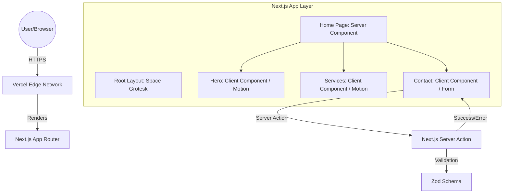

# Yash Labs Architecture Document

**Project Name:** Yash Labs Landing Page  
**Status:** Approved  
**Version:** 1.0  
**Author:** BMad Architect (Winston)

---

## 1. Introduction

This document defines the technical blueprint for the Yash Labs landing page. It is optimized for high-performance rendering (Lighthouse 90+), seamless animations (Framer Motion), and a "Premium" developer experience using the Next.js App Router.

### Starter Template & Foundation
*   **Framework:** Next.js 14+ (App Router)
*   **Language:** TypeScript (Strict Mode)
*   **Styling:** Tailwind CSS (Utility-first)
*   **Initialization:** `npx create-next-app@latest --typescript --tailwind --eslint --app`

### Change Log
| Date | Version | Description | Author |
| :--- | :--- | :--- | :--- |
| 2023-10-27 | 1.0 | Initial Architecture for Yash Labs | Winston (Architect) |

---

## 2. High-Level Architecture

### Technical Summary
The application leverages **React Server Components (RSC)** for structural rendering and SEO, while isolating interactivity (animations and forms) into **Client Component Islands**. This minimizes the client-side JavaScript bundle and ensures a fast "First Contentful Paint" (FCP).

### High-Level Project Diagram


---

## 3. Tech Stack

| Category | Technology | Version | Purpose |
| :--- | :--- | :--- | :--- |
| **Framework** | Next.js | 14.x | Core Web Framework (App Router) |
| **Language** | TypeScript | 5.x | Type Safety & Interface Definition |
| **Styling** | Tailwind CSS | 3.x | Design System & Glassmorphism Utilities |
| **Animation** | Framer Motion | 11.x | Motion Identity (0.6s easeOut) |
| **Icons** | Lucide React | Latest | High-fidelity futuristic icon set |
| **Validation** | Zod | 3.x | Schema-based form validation |
| **Form Logic** | React Hook Form | 7.x | Performant form state management |
| **Deployment** | Vercel | N/A | Global Edge Hosting & CI/CD |

---

## 4. Data Models & Interfaces

### Shared Types (`src/types/index.ts`)

```typescript
export interface ServiceItem {
  id: string;
  icon: string; // Refers to Lucide icon name
  title: string;
  description: string;
}

export interface StatItem {
  label: string;
  value: number;
  suffix: string;
}

export interface LeadSubmission {
  name: string;
  email: string;
  message: string;
}
```

---

## 5. Component Architecture & Source Tree

### Component Strategy: Atomic Organisms
We use a modular approach where each section of the page is an "Organism" that utilizes "Atoms" (UI primitives).

```plaintext
src/
├── app/                    # App Router Routes
│   ├── layout.tsx          # Font & Context Setup
│   ├── page.tsx            # Main Entry (Imports Sections)
│   └── globals.css         # Custom Glassmorphism Classes
├── components/
│   ├── ui/                 # Atoms (Button, Input, Card)
│   │   ├── Button.tsx
│   │   ├── Input.tsx
│   │   └── GlassCard.tsx
│   ├── sections/           # Organisms (Page Sections)
│   │   ├── Navbar.tsx
│   │   ├── Hero.tsx
│   │   ├── Services.tsx
│   │   ├── About.tsx
│   │   └── Contact.tsx
│   └── shared/             # Molecules (StatsCounter, IconBox)
├── constants/              # Static Content Data
│   └── index.ts            # (Services data, Stat values)
├── lib/                    # Core Utilities
│   ├── utils.ts            # Tailwind Merge / cn()
│   └── validations.ts      # Zod Form Schemas
└── types/                  # Type Definitions
```

### Critical Coding Rules for AI Agents
1.  **Glassmorphism Utility:** All glass components must use the base class: `bg-white/5 backdrop-blur-md border border-white/10`.
2.  **Client Boundaries:** Use `"use client"` only at the section level to encapsulate Framer Motion hooks.
3.  **Animation Standard:** Duration: `0.6s`, Easing: `easeOut`.
4.  **Semantic SEO:** Use proper `<section>` tags for each section and `<h1>` for the Hero headline.

---

## 6. Infrastructure & Deployment

*   **Platform:** Vercel
*   **Performance:** Image optimization via `next/image`; automated CSS purging via Tailwind.
*   **Testing:** Vitest + React Testing Library for component rendering and form validation logic.
*   **Typography:** Google Fonts (Space Grotesk) loaded via `next/font/google` for Zero-CLS.

---

## 7. Next Steps
1.  **Epic 1 Initialization:** Setup the project structure and Tailwind theme.
2.  **UI/UX Specification:** UX Expert to define exact staggered animation values.

